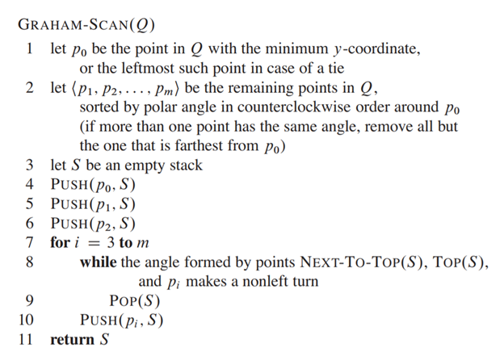
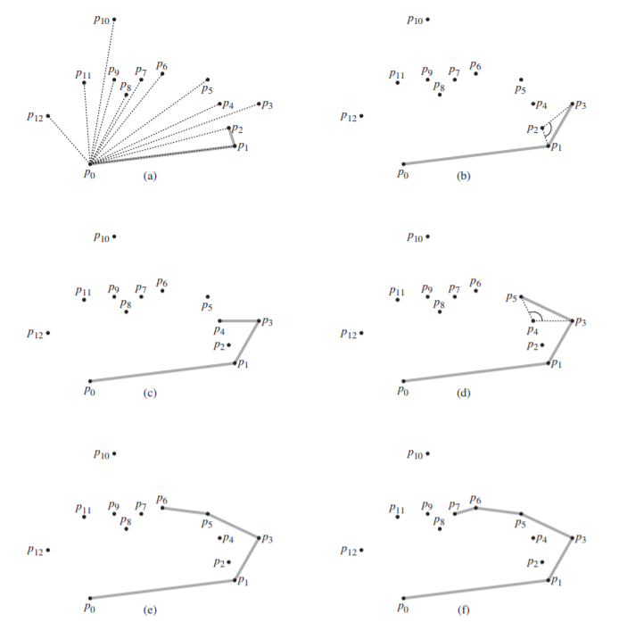
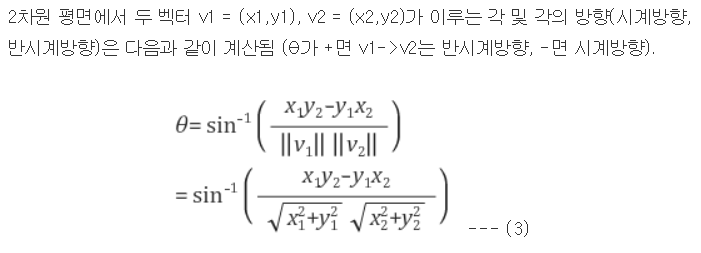

# Convex Hull 

2차원 평면상의 여러개의 점이 있을 때
그 중 일부를 사용하여 볼록 다각형을 만들 수 있다.

그러한 볼록 다각형 중, **최소한의 점**을 사용하여 모든 점을 내부에 포함시키는 다각형을 찾는 알고리즘이다. 

이를 **O(NlgN)**의 시간 복잡도로 해결할 수 있는 알고리즘 중 하나로  Graham scan 이 있다. 

#### Pseudo-Code

Graham Scan(Dots)

1. 가장 y축 값이 작은 기준점을 찾는다
2. 만약 1을 만족하는 점이 2개 이상이면 x축 값이 작은 점을 찾는다. 
3. 기준점을 원점으로 하여 각 점이 갖는 각도를 계산한다 
4. 각도가 커지는 순으로 점들을 정렬한다.
5. 스택을 만든 후, 먼저 기준점과 가장 각도가 작은 점을 넣는다.
6. 정렬해둔 순서대로 점을 스택에 포함시키되, 상위 3개의 점을 이었을 때 왼쪽 영역에서 만들어지는 각도가 180도보다 큰 경우(시계 방향으로 회전하는 경우) 스택의 맨 위에있는 점을 빼고 다시 3개의 점을 구성하여 계산한다.

From Introduction to Algorithms

위 알고리즘을 따르면, 밑과 같은 순서로 Convex Hull 이 구성된다.

#### 기준점으로 좌하단의 점을 쓰는 이유

각도를 정렬 할 때, 0에서 180도의 범위로 점들의 위치를 제한하기 위함이다.

#### 각도를 계산하는 방법

실제 acos 함수를 사용하여 각도를 계산하는 것 보다, cos 값을 비교하는 것이 효율적이다.

물론, 각도가 작다는 것은 cos 값이 크다는 것을 의미하므로, 정렬의 방향에 주의하도록 하자.

#### 반시계 방향으로 회전하는지 어떻게 알지?

위 공식에서 세타가 0보다 크기 위해선, x1y2 - y1x2 의 크기가 0보다 커야한다.

점 A B C 가 있는 경우, 벡터 BA와 벡터 BC가 이루는 사잇각이 양수려면 위 식에서 x1y2 - y1x2 > 0이어야 한다.

**벡터 BA = (Ax - Bx) , (Ay - By) 를 2로**

**벡터 BC = (Cx - Bx), (Cy - By) 를 1로 두면** 

x1y2 - y1x2 = (Cx - Bx)(Ay - By) - (Cy - By)(Ax - Bx) > 0 이어야 한다.

고로 정리하면 CxAy - CxBy - BxAy - CyAx + CyBx + ByAx > 0 이걸 이용해주면 된다.

**그럼 왜 벡터 BC를 1로 두는거죠?** (생각해보세요)

## 관련 문제

백준 1708 볼록 껍질 : <https://www.acmicpc.net/problem/1708>

백준 3878 점 분리 : <https://www.acmicpc.net/problem/3878>

###### 출처

Cormen : Introduction to Algorithm - Graham Scan Pseudocode

<https://darkpgmr.tistory.com/121> - 두 벡터의 사이각

