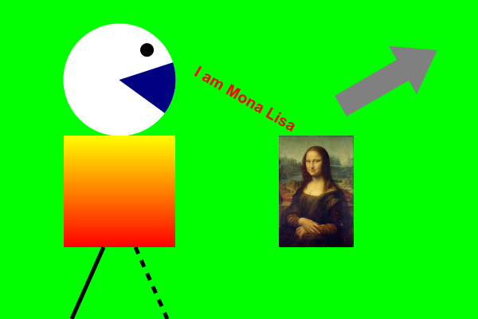

# Canvas

**Canvas API란?**

> Javascript와 HTML <canvas> 엘리먼트를 이용해 그래픽을 그리기 위한 수단을 제공한다. 주로 2D 그래픽에 중점을 두고 있다.

**Canvas API는 어디에 쓰이는가?**

> 애니메이션, 게임 그래픽, 데이터 시각화, 사진 조작 및 실시간 비디오 처리를 위해 사용됩니다.


**기본사용**

1. npm install canvas --save를 통해 canvas api 설치, const Canvas = require('canvas')를 통하여 가져온다.
2. canvas 엘리먼트는 고정 길이의 그리기 영역을 생성한다.
3. canvas 엘리먼트는 rendering context를 제공하여, 출력할 컨텐츠(그림)을 생성하고 다룰 수 있도록 한다.
4. rendering context 객체는 getContext() 메소드를 통해서 얻을 수 있다.

```javascript
//Web 
var canvas = document.getElementById('tutorial');
var ctx = canvas.getContext('2d');

//Node
const { createCanvas } = require('canvas')
const canvas = createCanvas(200, 200)
const ctx = canvas.getContext('2d')
```

**API 종류**

1. 직사각형(정사각형) 그리기

   - fillRect(x, y, width, height): 색칠된 직사각형을 그립니다.

   - strokeRect(x, y, width, height): 직사각형 윤곽선을 그립니다.

   - clearRect(x, y, width, height): 특정 부분을 지우는 직사각형이며, 이 지워진 부분은 완전히 투명해집니다.

   ```javascript
   ctx.fillRect(25, 25, 100, 100);
   ctx.clearRect(45, 45, 60, 60);
   ctx.strokeRect(50, 50, 50, 50);
   ```

2. 원(원호) 그리기

   - arc(x, y, radius, startAngle, endAngle, anticlockwise): (x, y) 위치에 원점을 두면서, 반지름 r을 가지고,  *startAngle* 에서 시작하여 *endAngle* 에서 끝나며 주어진 *anticlockwise* 방향으로 향하는 (기본값은 시계방향 회전) 호를 그리게 됩니다.
     - x, y: 원의 중심
     - radius: 반지름
     - startAngle: 원(원호)를 그리기 시작할 각도
     - endAngle: 원(원호) 그리기를 종료할 각도
     - anticlockwise: true로 설정하면 반시계 방향으로 각도가 움직인다.(default: false)
   - arcTo(x1, y1, x2, y2, radius): 주어진 제어점들과 반지름으로 호를 그리고,  이전 점과 직선으로 연결합니다.

   - 참고로, 라디안 각도를 사용하기 때문에, degree에 익숙하다면 아래 수식을 이용하자.

     ```radians = (Math.PI/180)*degrees```

   - 최종적으로 stroke를 사용하면 원호를 그리게 되고, fill을 사용하면 원을 채우는 형태로 그리게 된다.

     ```참고로 원을 채우는 형태에서, 부채꼴 모양의 경우, closePath를 사용하여 arc로 그린 원호의 양 끝점을 중점과 이어 주어야 한다!!```

   ```javascript
   //부채꼴 채우는 예제
   ctx.beginPath();
   ctx.moveTo(faceX, faceY);
   ctx.fillStyle = "#000066";
   ctx.arc(faceX, faceY, faceRadius, getRadian(-20), getRadian(35));
   ctx.closePath();
   ctx.fill();
   ```

3. 경로 그리기

   - beginPath: 새로운 경로를 만듭니다. 경로가 생성됬다면, 이후 그리기 명령들은 경로를 구성하고 만드는데 사용하게 됩니다.
   - closePath: 현재 하위 경로의 시작 부분과 연결된 직선을 추가합니다.
   - stroke: 윤곽선을 이용하여 도형을 그립니다.
   - fill: 경로의 내부를 채워서 내부가 채워진 도형을 그립니다.

4. 선

   - lineTo(x, y): 현재의 드로잉 위치에서 x와 y로 지정된 위치까지 선을 그립니다.

   ```javascript
   // 경로 그리기와 선을 이용하여 화살표 만드는 예제
   ctx.beginPath();
   ctx.moveTo(arrowBaseX, arrowBaseY); //시작
   ctx.lineTo(arrowBaseX, arrowBaseY - 20); //위
   ctx.lineTo(arrowBaseX + 50, arrowBaseY - 20); //오른쪽
   ctx.lineTo(arrowBaseX + 50, arrowBaseY - 20 - 20); //위
   ctx.lineTo(arrowBaseX + 50 + 30, arrowBaseY - 10); //화살표 중간
   ctx.lineTo(arrowBaseX + 50, arrowBaseY + 20); //아래
   ctx.lineTo(arrowBaseX + 50, arrowBaseY); //위
   ctx.lineTo(arrowBaseX, arrowBaseY); //원점
   ctx.fillStyle = "#666666";
   ctx.fill();
   ```

5. 이차곡선(Quadratic)과 베지어 곡선(Bezier)

   - quadraticCurveTo(cp1x, cp1y, x, y): cp1x` 및 `cp1y`로 지정된 제어점을 사용하여 현재 펜의 위치에서 `x`와 `y`로 지정된 끝점까지 이차 베지어 곡선을 그립니다

     ```1개의 제어점을 이용하여 곡선을 구성한다.```

   - bezierCurveTo(cp1x, cp1y, cp2x, cp2y, x, y): (`cp1x`, `cp1y`) 및 (cp2x, cp2y)로 지정된 제어점을 사용하여 현재 펜 위치에서 `x` 및 `y`로 지정된 끝점까지 삼차 베지어 곡선을 그립니다.

### Hands on example



- canvas_example.js 코드는 위 이미지를 만들어서 저장하는 코드가 작성되어 있음.  
- 각 변수별로 어떤 것을 어떻게 작업했는지 확인할 수 있으니 하나씩 지워보면서 수행하면 이해가 빠르다.

# 기타 이미지 관련

**SVG란?**

- 확장 가능한 벡터(Vector) 그래픽을 의미한다.
- XML 형식으로 그래픽을 정의한다.
- 웹을 위한 벡터기반 그래픽을 정의하는데 사용된다.(canvas는 비트맵 그래픽을 표현)

**SVG 장점**

- 확대하거나 크기를 변경해도 그래픽의 품질에 전혀 손상이 없다.
- 텍스트 편집기로 편집할 수 있다.
- 검색 색인, 스크립트 및 압축할 수 있다.
- 해상도에 관계없이 고품질로 인쇄 가능하다.

**SVG와 Canvas의 차이점**

- SVG는 XML의 2D 그래픽을 기술하는 "언어"이다
- Canvas는 Javascript로 2D 그래픽을 그려내는 API의 한 종류이다.

2. 다양한 이미지 파일 포맷에 대해 학습하고 정리한다.([참고자료](https://blank2.tistory.com/16))

**1. BMP: 비트맵**

- 그래픽 파일 포맷중 가장 단순한 구조를 가진 파일 포맷
- 장점
  - 압축하지 않은 원본 상태를 유지하기 때문에 화질이 매우 좋음
  - 데이터를 저장하는 과정에서 압축 가능
- 단점
  - 용량이 크다
  - 웹 브라우저마다 제한이 있다.
  - 레이어와 알파 채널을 지원하지 않는다.

**2. JPEG(JPG): 제이펙, 제이피지**

- 이미지 압축 모임에서 개발한 이미지 파일 형식이며, 웹/멀티미디어 환경에서 가장 널리 사용되고 있다.
- 장점
  - RGB/CMYK 모드를 둘다 지원한다.
  - RGB 이미지의 모든 컬러 정보를 유지한다.
  - 이미지를 만드는 사람이 손실압축방식을 통해, 이미지의 질과 파일크기를 결정할 수 있다.
- 단점
  - 투명 이미지 지원하지 않는다.
  - 압축률을 올리면, 이미지 질이 손상된다.
  - 레이어와 알파채널을 지원하지 않는다.

**3. GIF: 지프, 기프**

- 최대 256 색까지 저장할 수 있는 비손실 압축 형식의 그래픽 포맷
- 장점
  - 하나의 파일에 여러 비트맵을 저장하여 다중 프레임 애니메이션 구현 가능
  - 투명 이미지 지원
  - 특별한 플러그인 없이 애니메이션 적용 가능
- 단점
  - 8비트 256컬러로 제한된다.

**4. PNG: 핑, 피엔지**

- JPG와 GIF의 장점을 합친 그래픽 포맷
- 장점
  - 비손실 압축방식 사용, 원본 손상 없이 파일 크기 감소
  - 이미지의 모든 컬러와 알파 채널을 보존하고 있으므로 포토샵 활용 용이
  - 문자 또는 날카로운 경계가 있는 이미지의 경우 더 잘 표현
- 단점
  - 애니메이션 불가능
  - GIF, JPG 보다 용량이 크다

**5. TIFF(TIF): 티프**

- 운영체제 및 기종에 상관없이 파일을 공유하기 위해 개발한 이미지 포맷
- 장점
  - 맥과 윈도우 모두 사용 용이
  - 여러 색상 모드를 유지한 채 저장 가능하며, 알파 채널 지원
  - 다양한 압축 방법 제공
- 단점
  - 파일 용량이 크다

**6.RAW: 로우**

- 카메라의 이미지 센서로부터 얻어진 가공되지 않은 원본 그대로의 정보를 갖고 있는 파일포맷
- 장점
  - 원본 그대로의 좋은 화질
  - 이미지를 원본 그대로부터 보정 및 조정 가능
- 단점
  - 파일 용량 크다
  - 카메라가 카드에 이미지를 기록시 JPG보다 느리다.

### Reference

[최성찬 개발자님 github 링크](https://github.com/chsch911028) 

