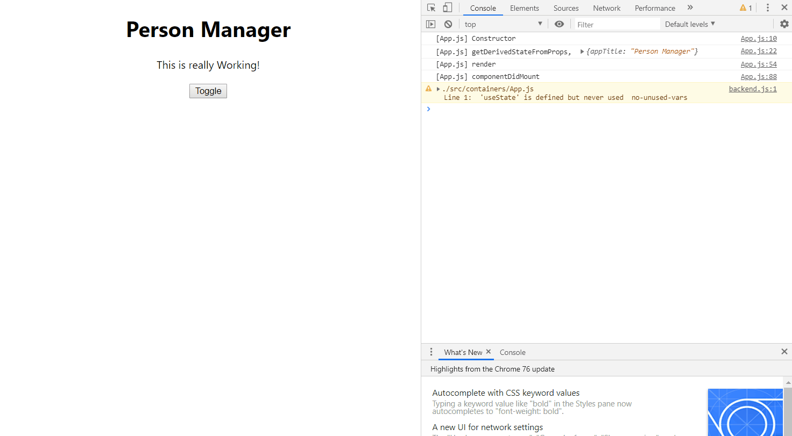

# Components Lifecycle (Creation)

> 컴포넌트를 생성할 때의 Lifecycle 입니다.


### Component Lifecycle

>  Lifecycle이란 컴포넌트가 Mount되고, Update되고, Unmount 되는 일련의 과정을 의미한다.


#### Componenet Mounting 시 (Creation) 실행되는 Hook의 순서

1. constructor(props)
   - 사실 이건 Class 의 생성자라 Hook이라 말하긴 어렵다. 
   - props를 입력으로 받아 객체를 생성한다.
   - **Side effect가 생기는 작업을 수행하면 안된다.**
2. getDerivedStatefromProps(props,state)
   - Class Based에서 props가 초기화되거나 변경되는 경우에 실행되는 함수이다.
   - **component instance에 접근할 수 없는 static method 이다. **
   - state와 props를 비교해서 둘의 값이 다른 경우 새로운 props를 state에  할당해준다.
   - **state를 할당하기 위해선, setState가 원하는 값을 리턴해주면 된다.**

3. render()
   - 말 그대로 render 할 jsx를 리턴해주는 함수이다.
4. Render Child Components
   - 모든 child component가 Render 될 때 까지 기다린다.
5. componentDidMount()
   - **여기서 Side Effect를 수행한다. (Render 되었기 때문..)**
   - HTTP Request를 통해 데이터를 업데이트한다. (fetch 하여 뭔가를 할듯)
   - 여기선 State를 Update 해서는 안된다. (그러면 또 reRender 되니까.. )


#### Constructor

```javascript
constructor(props){
    super(props);
    console.log('[App.js] Constructor');
    this.state = {
      persons : [
        { id : "a", name : "Max", age : 28},
        { id : "b", name : "John", age : 15},
        { id : "c", name : "Doll", age : 2},
      ],
      showPersons:false,
    }
  }
```

- 이전엔 그냥 state = ~ 로 바로 설정했지만, 실제 동작은 constructor에서 state를 설정해주는 것과 동일하게 작동한다. 어디서 하든 똑같다.
- super(props) 를 꼭 실행해준다.


모든 hooks에 콘솔을 찍어보았다.




constructor -> getDerivedStatefromProps -> render -> componentDidMount 순으로 작동하는 것을 볼 수 있다.

또, 상위 Component가 먼저 render되고, 그 후에 하위 Component가 Render 되는 것을 확인할 수 있다.


### 참고

https://blog.r-bertko.com/19 -> React Lifecycle

http://projects.wojtekmaj.pl/react-lifecycle-methods-diagram/ -> Official React Lifecycle