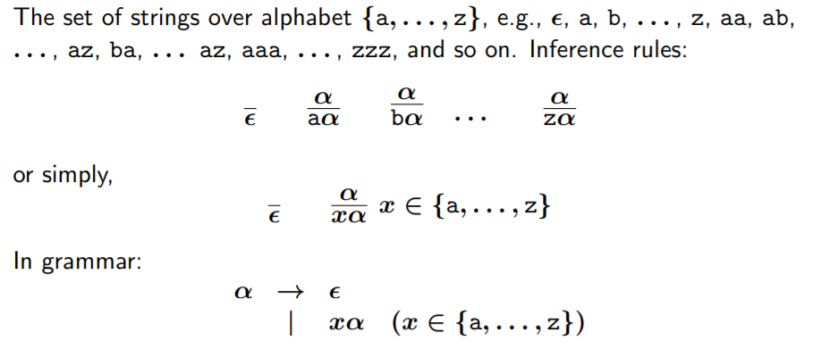
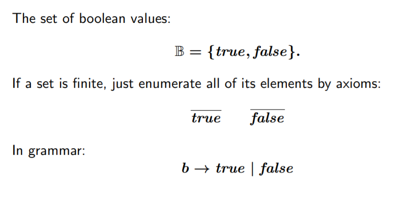
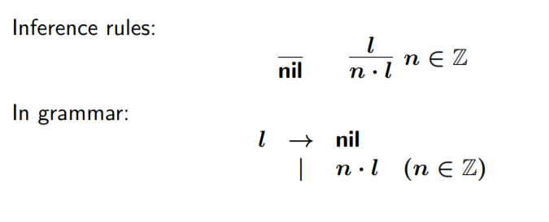
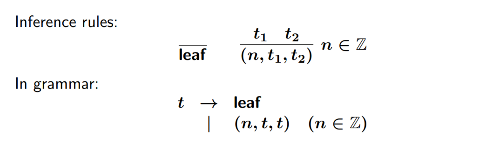
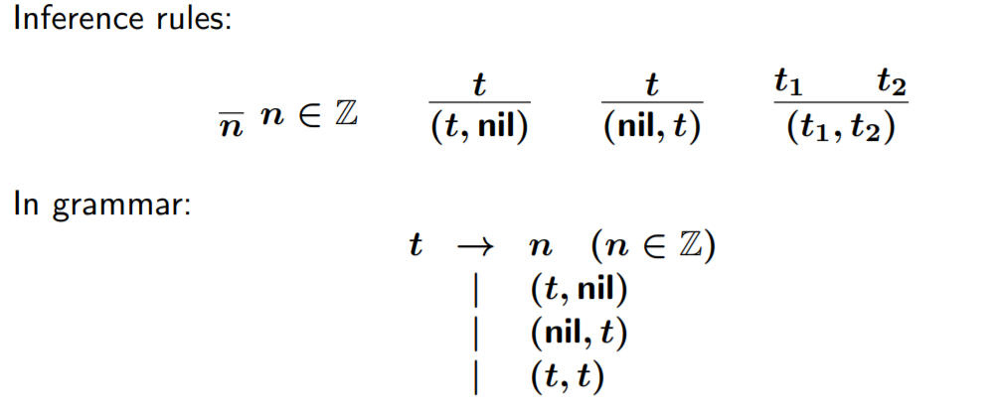
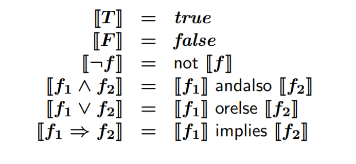
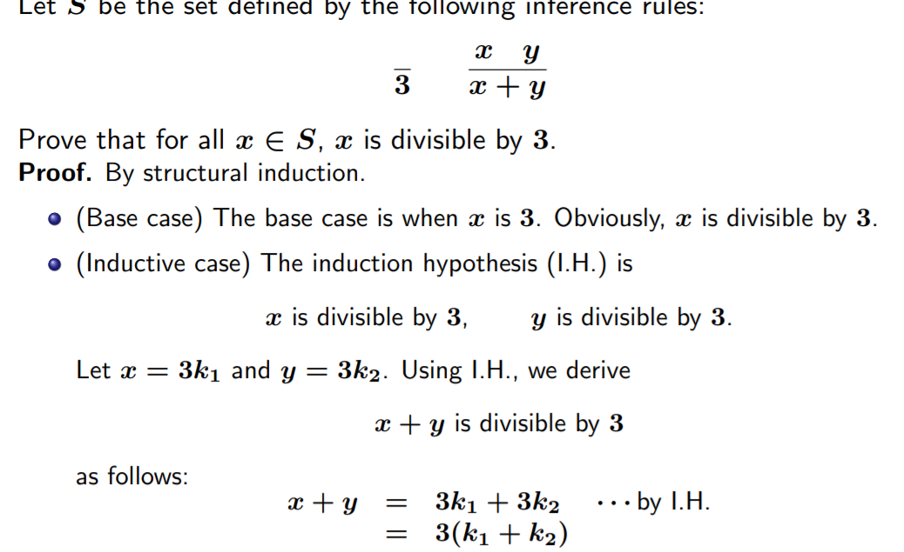
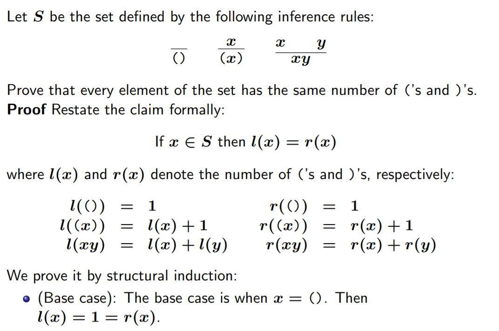
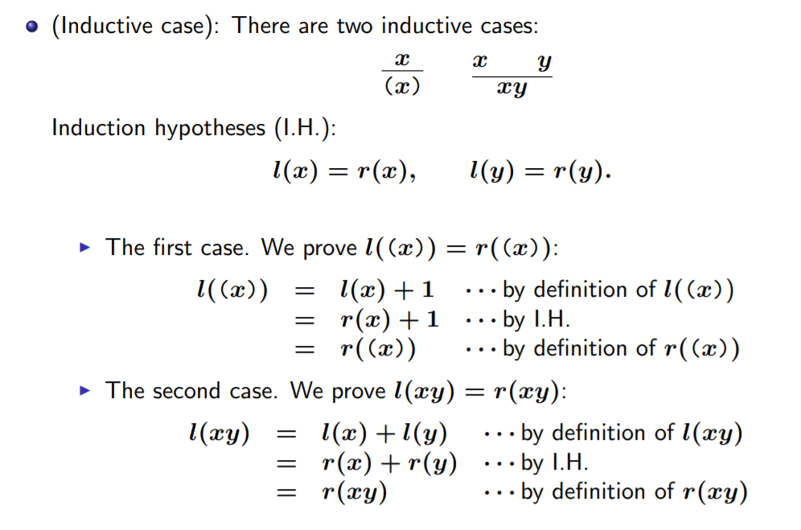
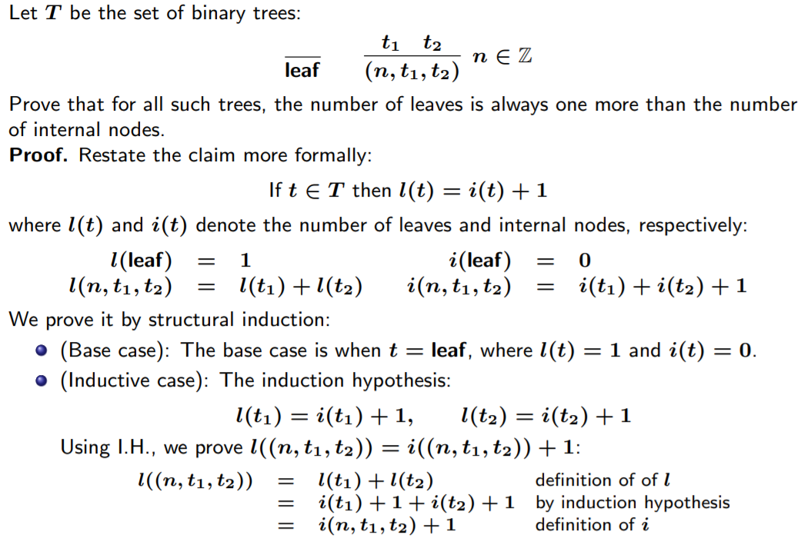

# Lecture 2 - Inductive Definition - (2)

### More Examples of Inductive Definition

**Natural Numbers**

**Strings**

(set of strings over alphabet)

**Boolean**

**List**

(List of Integer 예시)

**Binary Tree**

위 방법은 (node, left, right) 순으로 notation을 할 때 사용되는 방식이다.

위 방법은 (left, right) 로 notation을 할 때 사용되는 방식이다.

**Propositional Logic (명제 논리)**

이건 뭐 익숙하다. 

**Structural Induction (구조적 유도)** 

구조적 유도는 특정 Proposition을 증명하는 방법인데, 밑의 2가지를 증명함으로서 증명한다.

- 1) Base-case - 특정 Proposition이 단순한 구조에서는 true임을 보임
- 2) Inductive-case - s의 substructure 에서 P를 만족한다면, all structure s에 대해서 만족함을 보임 

구조적 유도를 통해 여러 예제를 증명해보자.

먼저 Base Case 인 3인 경우를 증명하고, x와 y가 3의 배수일 때(substructure 만족), x+y가 3의 배수임을 보였다. (all structure 만족)

주어진 문제는 해당 inference rule을 만족하는 S 에 대해서 x가 S에 포함될 시 l(x)와 r(x)가 같다는 것을 증명하라는 것이다. 

그럼 먼저 Base Case를 따져보면, x = () 일 때 l(x) = 1 = r(x) 로 만족하게 된다.

Inductive case를 두가지로 나누어 증명하면

- l((x)) == r((x)) 를 증명하기 위해 l((x)) = l(x) + 1 로 변경하고, r((x)) = r(x) + 1 로 변경하여 해결
- l(xy) 는 l(x) + l(y) 로 분리하여 해결.

읽어보면 이해 될 것이다.

**결론**

- CS는 Inductive Definition 들로 이루어져 있다.
  - Primitive values, compound values, language syntax and semantics 모두.
- Structural induction은 귀납적으로 정의된 집합에 대해 추론하는 좋은 방법이다.